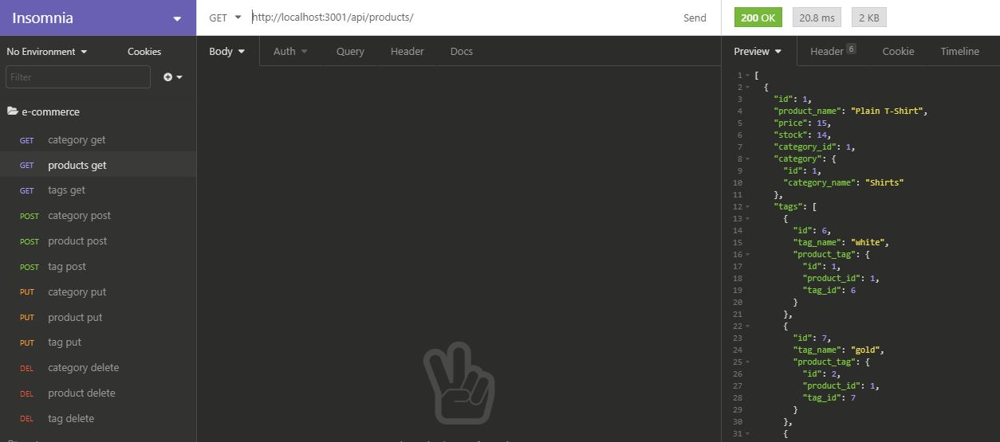

# E-commerce Back End 

This is the back end for an e-commerce site. It allows you to enter, delete, update and select products, categories, tags and product tags through the server-side APIs.

Products are associated with tags through many-to-many relationship. Products and categories have one-to-many relashionship.

# Technologies used

* Node.js
* Express.js
* npm, MySQL2, Sequelize, dotenv
* MySQL database
* Insomnia

# Functionality of the application - Video

https://drive.google.com/file/d/11fDNyAmj2zRqzddM2fHlUWQJWdoG6hqJ/view?usp=sharing

# GitHub repository

You can find the repository here: https://github.com/evkonradi/e-commerce.

# Page preview

This is the preview of the initial page:

